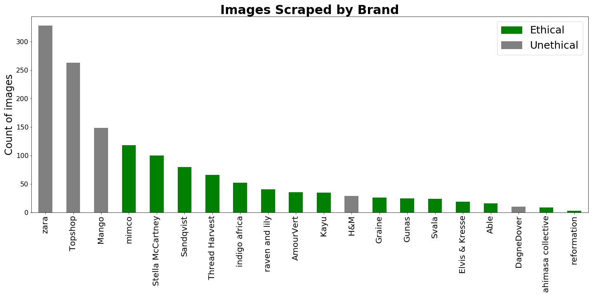
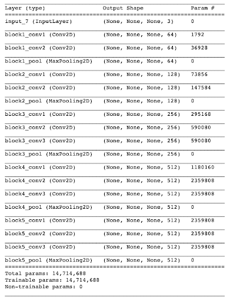
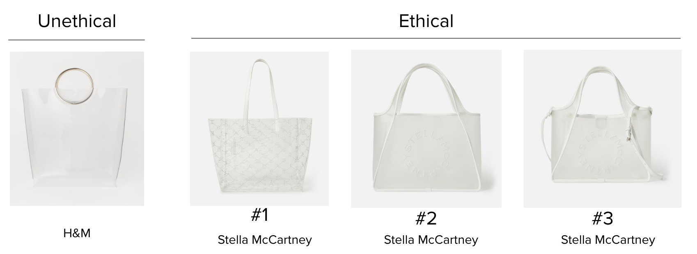
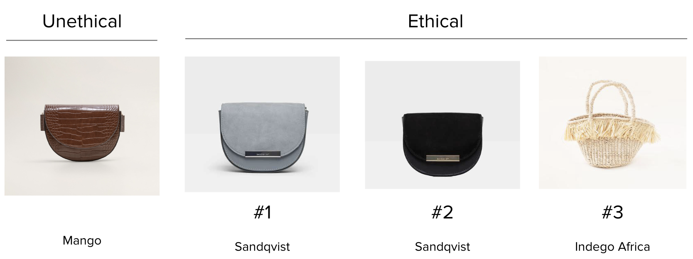
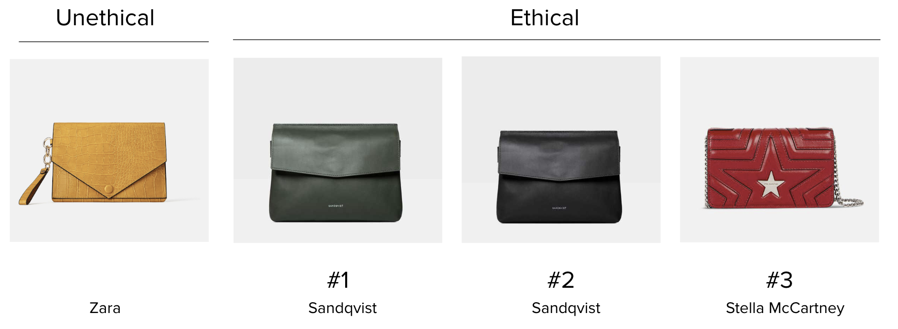
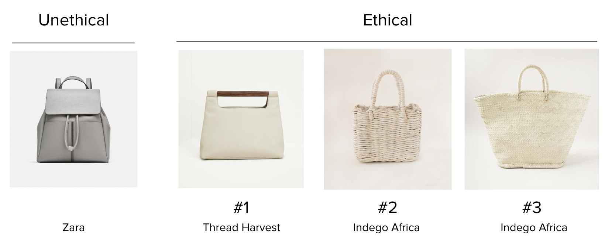

Recommend sustainable alternatives to popular fast-fashion handbags based on style and price similarities using convolutional neural networks (CNN) and feature extraction.

***
## Motivation

## Data Source & Methodology

__Data Source__
- [good on you](https://goodonyou.eco/) for sustainability ratings on fashion brands
- Web-scraped 1,500 images from 20 different brands using Selenium and BeautifulSoup

 

__Methodology__

1. <i>Conduct research.</i>
    - Get list of ethical brands and unethical brands that create handbags.
2. <i>Gather data. </i>
    - Scrape bag images, names, and prices.
3. <i>Extract features. </i>
    - Pass each bag image into pre-trained VGG16 model to extract features in matrix form.
3. <i>Calculate distances. </i>
    - Flatten feature matrices into vectors and calculate minkowski distances for each unethical bag to each ethical bag.
4. <i>Create recommendation function. </i>
    - Sort distance calculations in ascending order and yield x-number of most similar bag images (i.e. shortest distances)

__Modeling__

<b>VGG16</b>

 

## Results

Below are some of the results of the top 3 most similar ethical bags for a particular unethical bag. The model seems to be able to discern some high-level shapes and saturation but fails to accurately recommend the same bag type and finer details like color and texture.

 

 

 

 

## Takeaways

The out-of-the-box pre-trained model did not sufficiently extract features unique to handbags to recommend the most similar handbags, as demonstrated in the results above.

## Next Steps
- <i>Get more data.</i>
    - Scrape more bag images from other ethical sources (like consignment shops) and conduct more research into ethical brands (like nanushka)
- <i>Refine model.</i>
    - Customize pre-trained models (VGG16 and/or RESNET50) by freezing lower layers and training upper layers with bag images to conduct supervised learning so that model can predict different bag types (shoulder bag, tote bag, clutch, backpack, bum bag); extract features from the new model to find similar handbags by calculating minkowski distances or some other distance metric
- <i>Incorporate price.</i>
    - Be able to recommend products that are not only most similar in style but also in price.
- <i>Expand product line.</i>
    - Apply same methodology for shoes and clothing.
